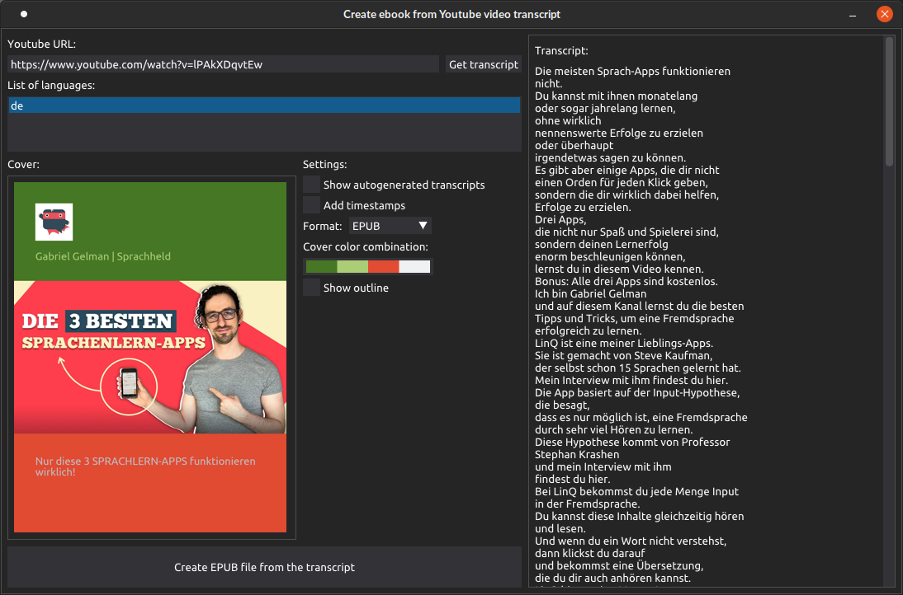
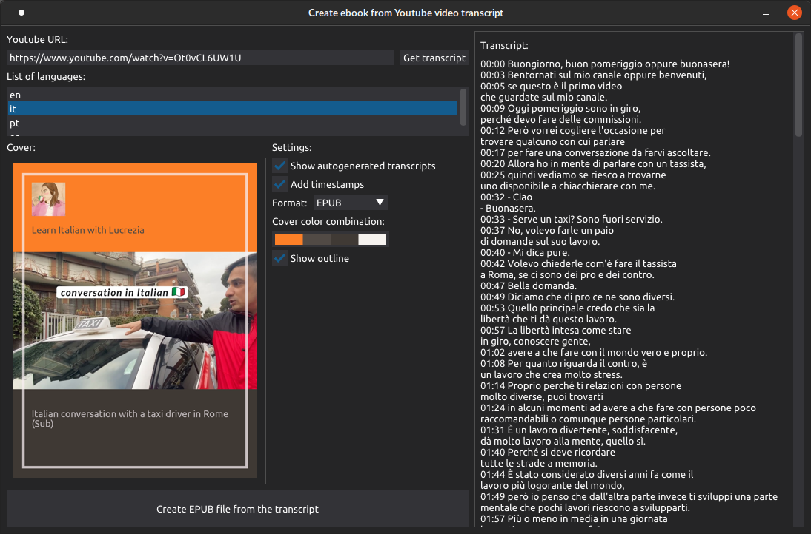
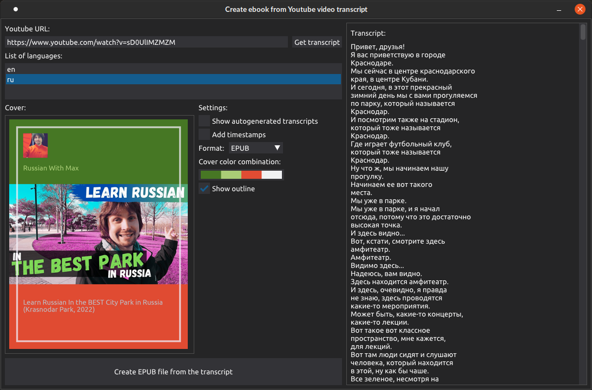

# Transcript to ebook

**Transcript to ebook** is a **tool**. It will help you get transcript from your favorite Youtube video in various formats.

As of right now supported formats include EPUB and TXT.




Cover generated will look like this:


# Instalation

Make sure you have Python 3 installed and working.

Get the repository:
```
git clone https://github.com/maticahacic/transcript_to_ebook.git
```
Install prerequisites using pip, preferably in a new environment:
```
pip install -r requirements.txt
```

# Usage


1. Run <i>transcript_to_ebook.py</i>
2. Paste YouTube URL into corresponding input field
3. After you are done with customizing press the big "Create **Filetype** ebook" button at the bottom
4. You can find file created in the root directory of the directory.